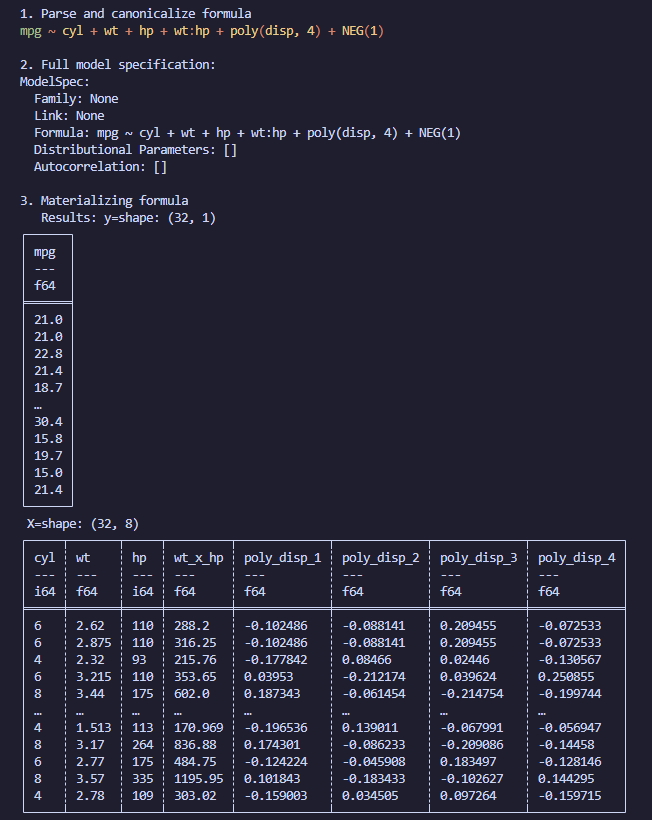

[](https://crates.io/crates/polars-formula)
[](https://docs.rs/polars-formula)
[](LICENSE)

<h1 align="center">polars-formula</h1>

<p align="center">A formula parsing and materialization library for Rust that brings R-style/Formulaic/Patsy formula syntax to the Polars DataFrame ecosystem.</p>

<p align="center">
  
</p>

## ⚠️ In development ⚠️

This library is in development and is not yet ready for production use.

## 🚀 Features

- **🔍 Formula Parsing**: Parse formulas like `y ~ x1 + x2 + x1:x2 + poly(x1, 3) - 1`
- **🧹 Clean Column Names**: Automatic cleaning of complex column names for better usability
- **🧮 Linear Algebra Ready**: Direct conversion to [faer](https://github.com/sarah-quinones/faer-rs) matrices (optional feature)
- **🎯 Comprehensive DSL**: Advanced parser supporting complex statistical formulas
- **🔄 Canonicalization**: Automatic formula expansion and normalization
- **🎨 Colored Output**: Beautiful syntax highlighting for formulas

## 📦 Installation

Run `cargo add polars-formula` or add this to your `Cargo.toml`:

```toml
[dependencies]
polars-formula = "0.1"
polars = { version = "0.50", features = ["lazy"] }
```

To enable linear algebra conversions to `faer`, turn on the optional feature:

```toml
[dependencies]
polars-formula = { version = "0.1", features = ["faer"] }
```

## 🏃‍♂️ Quick Start

### Basic Formula Parsing, coloring, and materialization

```rust
fn main() -> Result<(), Box<dyn std::error::Error>> {
    // Simple dataset
    let df: DataFrame =
        CsvReader::new(std::fs::File::open("examples/data/mtcars.csv")?).finish()?;

    // Original formula
    let formula_str = "mpg ~ cyl + wt*hp + poly(disp, 4) - 1";
    println!("Original: {}", formula_str);

    // Colored version (original syntax preserved)
    let color_pretty = Color::default();
    println!("Colored:  {}", color_pretty.formula(formula_str));

    // Canonicalized version (for comparison)
    println!("Canonicalized: {}", color_pretty.formula(formula_str));

    // Materialize the formula
    let formula = Formula::parse(formula_str)?;
    let (y, x) = formula.materialize(&df, MaterializeOptions::default())?;

    // Print the results
    println!("y: {}", y);
    println!("X: {}", x);

    Ok(())
}
```

<p align="center">
  
</p>

## 📚 Examples

Run the examples to see the library in action:

```bash
# Basic formula parsing
cargo run --example 01_simple_formula

# Colored output demo
cargo run --example 02_colors

# Advanced DSL features
cargo run --example 04_dsl_comprehensive

# Clean names demo
cargo run --example clean_names_demo
```

## 🔧 Supported Formula Syntax

### Basic Operations
- **Variables**: `x`, `income`, `age`
- **Addition**: `x1 + x2` (include both terms)
- **Interactions**: `x1:x2` (product of x1 and x2)
- **Products**: `x1 * x2` (expands to `x1 + x2 + x1:x2`)
- **Intercept**: Automatically included (use `-1` to remove)

### Functions
- **Polynomials**: `poly(x, 3)` expands to x, x², x³
- **Identity**: `I(x)` for literal interpretation
- **Constants**: Numeric literals like `1`, `0` for intercept control

### Random Effects
- **Random Intercepts**: `(1|group)` - one random effect per group level
- **Random Slopes**: `(x|group)` - random slope for variable x per group
- **Uncorrelated**: `(x||group)` - uncorrelated random effects

### Advanced Features
- **Family Specification**: `y ~ x, family=gaussian()`
- **Distributional Parameters**: `y ~ x + sigma ~ z`
- **Autocorrelation**: `y ~ x + ar(p=1)`

## 🎯 Key Benefits

1. **R-like Syntax**: Familiar formula syntax for statisticians
2. **Type Safety**: Rust's type system ensures correctness
3. **Performance**: Built on Polars for high-performance data manipulation
4. **Extensibility**: Easy to add new formula features
5. **Integration**: Seamless integration with the Rust data science ecosystem

## 🔮 Future Features

- **Categorical Variables**: `C(category)` for factor encoding
- **Spline Functions**: `s(x, k=10)` for smooth function approximations
- **Time Series**: Lag operations and ARIMA support
- **Custom Functions**: User-defined transformations
- **Model Fitting**: Direct integration with statistical modeling libraries

## 🤝 Contributing

Contributions are welcome! Please feel free to submit a Pull Request. For major changes, please open an issue first to discuss what you would like to change.

## 📄 License

This project is licensed under the MIT License - see the [LICENSE](LICENSE) file for details.
